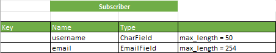
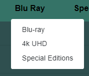
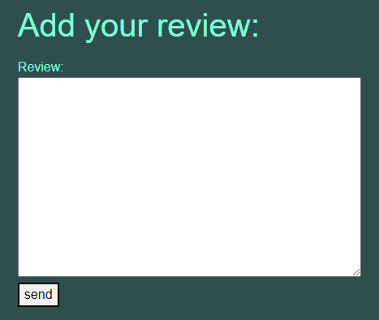

# D15 Movie Lovers Store

This is the eCommerce website of the D15 Movie Lovers Store. A store front specialising in the sale of top qulity boutique label Blu Ray, 4k UHD and special editions of Movies. The overall idea from Portfolio Project 1 to this final project was to create a full D15 Movie Lovers Club which would incorporate a Blog (Portfolio Project 4), Quiz (portfolio Project 2) and a Store Front (portfolio Project 5) to cater to a healty and growing Movie Lovers club in the Dublin 15 area. And also to grow a separate customer base with niche interets in Physical Media through this eCommerce platform. I have a secondary goal of siging up non club customers to a Newsletter with the intention of also growing the club member numbers by eventually offering Club Member only discounts and special deals, through the Newsletter, in association with the UK Blu Ray labels such as Eureka, Arrow Video, Indicator and 88 films.

# View live site here: https://d15-movie-lovers-store.herokuapp.com/

# Marketing Strategy

## <u>Customers</u>
The site caters to a niche customer base. People whom appreciate the experience of watching movies in the highest quality possible. Physical media enables us to enjoy films, of all types and genres, in their best formats through modern remastering techniques, proper and original colour gradings and free from the inadequacies of streaming platforms such as poor availability of titles and artefact creep (blocky transitions) in darkly shot scenes. There is a healthy customer base of 'Movie Lovers' as evident in the availability of extremely rare films on modern boutique label releases. A quick scan of the bigger boutique lable companies in the UK such as 88 Films, Eureka, Indicator and Arrow Video (not to mention the myriad labels in the US) and its clear there is a healthy desire still for high quality physical media.

## <u>Products</u>
This platform will cater to the Irish customer base and I believe it is the only Physical Media dedicated site in Ireland. The primary product focus is the sale of high quality Blu Ray, 4k UHD and Special Editions of films. The product will be sourced in bulk from the UK labels 88Films, Eureka, Arrow Video and Indicator. With future expansion the company could source US editions from labels such as Vinegar Syndrome, Shout Factiry, Scream Factory etc. The company also intends to stock Movie Memoribillia, T-Shirts, Action Figures, Vinyl Soundtracks etc as the customer base grows.

## <u>Payment</u>
Stripe has been implemented to the site as a relatively user friendly payment system. The payment structure to the site is a common process. CLient will add the items they wish to buy to the Bag, enter sucre checkout, validate the purchases on the summary, enter the payment screen, enter personal details and credit card details and complete purchase.

# Web Marketing
## Users:
Users are people interested in Physical Media collecting and Movie Lovers. Users can regularly be found in dedicated blogs, Dedicated FaceBook groups, Instagram channels and commenting on Physical Media youtube videos. While its hard to make an informed judgement on the age group of Physical Media customers I will say, from my own engagements and club membershibs, that it seems to be more common in the 30-60 age group. 

## Which Social Media Platform to use for promotion:
According to Hootsuite.com (Link: https://blog.hootsuite.com/facebook-statistics/):
- 50% of Facebook Users want to discover new products through Facebook stories.
- There are 1 Billion active users in the Facebook Market place.
- Facebook marketplace ads reach 562 million people.
- 79% of monthly users are active daily and finally Facebook is the favourite social platform of the 35-44 demographic.

It is clear from the stats above that using Facebook to promote the D15 Movie Lovers Store is essential. However Youtube and Instagram will also be implemented in the future. According to Wallaroomedia (link: https://wallaroomedia.com/blog/social-media/tiktok-statistics/) 80% of US Tik Tok Users are aged between 18-34. The age range and the general use of Tik Tok as a performance platform I dont see how Tik Tok could help the promotion of the D15 Movie Lovers Store at this time. Efforts should be spent on promotion through Facebook.

## Online Content and User engagement:
From my own experiences as a movie collector and avid Physical Media champion I find a lot of my information comes from Facebook groups, Youtube creators and reviewers and Instagram influencers regularly creating content around upcoming releases, rumoured releases and unboxing and review based content. It is my intention to start a channel with Youtube and a page with Instagram to compliment the Facebook page at a future date. Online creators have been instrumental in my own sourcing of Blu Ray, 4k UHD and special editions of certain Movies and I believe I can also engage with customers, Club Members and a wider untapped audience through such content.

## Sales and Discounts:
The business will run Sales over holiday periods and intermittent Club Member discount campaigns throughout the year. However the Offers section of the website is currently blank and will be updated once an actual offer campaign is devised.

## Business Goals and strategy:
The business goal is to first and foremost sell our product, for profit to our target demographic. A secondary goal is to add memebers to the D15 Movie Lovers Club and to grow the business customer base in Ireland using the Club and Newsletter. The marketing strategy for the site will be Search Engine Optimisation, email marketing through the Newsletter and social media marketing with the implementation of a Facebook page. I intend to grow the Facebook page and regularly post updates on new releases, low stock items, general movie 'banter' etc.

The beauty of using basic SEO, the Facebook page and the Newsletter for marketing is its free. I dont intend to spend on advertising until I know I have used this strategy as far as it will take the platform.

## Email Marketing
I set up a custom Newsletter service. Once the User registers with t he site they can then sign up for the Newsletter.

## Facebook page:

## Privacy Policy:
https://www.privacypolicygenerator.info was used to generate a standard Privacy Policy.

Please see Privacy Policy here:
https://www.privacypolicygenerator.info/live.php?token=rvpuphBIoDGo13y658txPwQQ9RnYARQQ

## Search Engine Optimization:
The site was built with Key Words in Mind. Throughput tghe site you will note th euse of keywords directly related to Movies. A basic list of keywords I include below for reference:

## Sitemap.xml
A sitemap was generated and included using XML-sitemaps.com. This lists the relevant URLs to facilitate search engine navigation through the site with a goal to making the site more likely to display as high up the search engine listing as possible. The sitemap was generated by following these steps:
1. Navigate to XML-sitemaps.com
2. Paste in the deployed site where prompted
3. Download the sitemap file
4. Make sure the file is named 'sitemap.xml and add it to the root folder 

## robots.txt
I created a robots.txt file to ensure search engines dont crawl through sensitive sections of the site. Which ultimately facilitates a mre robust search engine process and imporving the SEO overall.

# Strategy

## <u>Agile</u>
* The Agile framework was applied to this project using Github views and issues tab. I created a template and applied the template to each user story.
* I collected the user stories by interviewing a family member as a mock user.
* I assembled the user stories onto a kanban board in Github under the headings 'To Do', 'In Progress' and 'Done'. Using each column effectively kept the project moving toward completion. Breaking the work up into iterations helped to reduce the enormity of the project to manageable work sessions.
* Learning from my Portfolio Project 4 feedback I also implemented a tag system to highlight the requirments of each work item. Adding to this a commented update on each work item while implementing an imagined feedback from a Project Manager to mimic a real world setting.
* Not all user stories were effectively completed however I have retained all non completed work items as a baseline for improvement and adding features in the future.

## <u>Project Goal</u>
* The idea behind the D15 Movie Lovers Store was to create a store that can easily fit in with my previous portfolio projects: PP1 The D15 Movie Lovers Club and PP2 The D15 Movie Lovers Quiz and PP4 The D15 Movie Lovers Blog with the overall intention to merge these projects up into one well structured Club page with a store front, club page, social aspect through the Blog and user interactivity with a movie quiz. I believe there is a desire and hunger in my local area for Movie lovers to unite and my club ambitions with an associated store could be a successful club and business plan. 
* I kept the styling, colours and overall look in line with my PP1, PP2 and PP4 with a long term goal of merging the three projects together to create a viable club website with member(user) interactivity and contributions with a focus on responsive and simple design.
* I want Users to register, log in and log out in a simple manner while being able to read stock item descriptions with ease facilitating regular purchases. I also added a review function allowing users to add, edit and delete reviews of the Stock Items. This helps to create a bigger sense of belonging with the buisness users and club users.
* Implement full CRUD functionality in allowing the user to write, edit and delete a review.

## <u>Data Models</u>
* I have listed the models used below for quick reference and included in a basic schema:
1. <u>In the checkout app:</u>
- class Order(models.Model)
- class OrderLineItem(models.Model)
2. <u>In the Home app:</u>
- class Subscriber(models.Model)
3. <u>In the Products app:</u>
- class Genre(models.Model)
- class Region(models.Model)
- class Format(models.Model)
- class Stockitem(models.Model)
- class Review(models.Model)

* Full Models Schema:

* Individual Models:

## <u>User Stories</u>
## Completed User Stories:
<u>As a regular visitor to the site I can:</u>
- login with ease so that I can get to shopping quickly or write up reviews

- read simple product descriptions so that I am better informed of my product choices

- easily search for products so that I can find specific products without the need to view all products

- view high quality images of the products so that I can pick my desired product with ease

- sign up for a newsletter so that I can stay informed of new updates to the store

- filter the stock items so that I can quickly find what I am looking for

- view my cart but also return to shopping without entering the payment screen so that return to shopping and payment are two separate options which makes it easier to return to shopping or go to payment

- easily pay for my selected products so that I am more likely to visit the store again

- gather my selected products in a user friendly shopping cart so that I can review and pay for my products with ease

- delete my reviews so that I can remove my reviews when I see fit

- write reviews of products on a user friendly form so that I feel more connected with the club and the company

- easily edit my reviews so that I can make sure my reviews are accurate

## User Stories not completed in this iteration:
<u>As a regular visitor to the site I can:</u>
- leave reviews and ratings so that I can help better inform the next person of the quality of the product

- select a 'Notify Me' option when a product is out of stock so that I am notified when the product is in stock

- clearly see stock availability for each product so that I can make a more informed decision when shopping

- easily visit the stores social media presence** so that I can engage with the business more regularly

The four user stories not completed have been noted for future development. It was simply a timing issue in this case to not include these stories in the initial development block. An effort to prioritise work items rendered the four above non essential.

## <u>Design</u>
The project scope was reduced and simplified as I approached my deadline. I decided to concentrate on coding the store in a simple fashion with full CRUD functionality intact. 

The user stories relating to 'ratings', 'Notify me', 'Stock availability' and 'social media presence', while not implemented at this stage of development due to timing constraints will be added to the store at a later date.

I relyed very heavily on the course content walkthrough project 'Boutique Ado' and while a lot of the desigin elements from the project has carried over I made sure to 'reengineer' the design to my own purposes. Hence the colour scheme and Typograpy are used from the previous portfolio projects PP1, PP2 and PP4. This is to maintain a uniform approach so as when the individual projects are merged into one Store/Club offering for the D15 area, the design will match.

The main colour scheme used is:
- Background Colour: #2F4F4F
- Header colour: #357367
- Text colour: Aquamarine

## Imagery
As the site is a movie physical media store I have included 11 films as example products. I chose films that are a mixture of well known classics and some rarer titles to appeal to the collector sensibility

## <u>Wireframes</u>

* Landing page desktop:

* All Products page desktop:

* Individual Product page desktop:

* Secure Checkout page desktop:

* Checkout page desktop:

* Payment Complete page desktop:

* Landing page tablet:

* All Products page tablet:

* Individual Product page tablet:

* Secure checkout page tablet:

* Checkout page tablet:

* Payment complete page tablet:

* Landing page mobile:

* All product page mobile:

* Individual product page mobile:

* Secure checkout page mobile:

* Checkout page mobile:

* Payment complete page mobile:

## <u>Differences between the Wireframes and finished blog</u>

* You will note from the mobile Wireframe presentation that the Search, Account and Bag icons should be aligned. Unfortunately as time was becoming more of an issue I sacrificed fixing the Search, Account and Bag icons in the actual site. Currently they are slightly un-aligned.
* Generally speaking the site matches the Wireframes with some very small variances.

## <u>Features</u>

* Nav Bar, built using bootstrap and visible across the site

* My Account and Bag buttons on the Nav Bar highlights when hovered on

* Every button on the site highlights when hovered on:

* Drop down list generates when user clicks on the My Account button Superuser example:

* Drop down list generates when user clicks on the My Account button non Superuser example:

* If there is nothing in the bag and the bag button is clicked the User is presented with a bag empty page:

* When the Movies and Blu Ray buttons are clicked on the nav bar a drop down menu presents to allow the user to access the type of product they're looking for with ease. If the user selects Price the products will be arranged by low to high, if the user selects Genre the Genres will be arranged alphabetically and if the User selects all products, all products will be shown. However I must note that due to timing the rating system was not implemented in development, therefore when a user clicks on this option it will generate in the same way the All Products option displays. Also to nte the Special Offers section has not yet been implemented, this has been noted for future development:

* Search bar in the header is fully functional:

* The Landing page introduces the user to the site and asks the user to register:

* Once the User has registered, the message changes to ask the user to sign up for the Newsletter:

* The user can click on either the Movie image or the movie title to generate the single product page:

* When a user adds a product to the bag a bag summary displays in the top right of the page:

* A dropdown box for sorting options displays to the right above the products to give the user the ability to sort the products by Price Low to High, Price High to Low, Name A-Z, Name Z-A, Genre A-Z and Genre Z-A (as previously noted the rating option is not functional at this time):

* A user can add, edit and delete review which satisfies CRUD and is also presented with notification messages on each function:

* A functional quantity update button added to checkout page:

* An example of quantity updated using the button:

* Order summary in the checkout page:

* A message displays if the user has not entered a correct email:

* A message displays on successful checkout:

* A full order summary displays once the checkout is complete:

* When a user signs in they recieve a successful sign in message:

* When a user wishes to sign out they will be prompted with a signout page:

* A custom 404 page was added:

* Django amin panel was used for this project. Out of the box it enables full administration functions. I include a screenshot of the base page below to give the reader an indication of the different functions added as per project requirements:

* New user sign up with email confirmation. I registered a new user using https://10minutemail.net/ to show how the email verification works once the user has registered:

* Newsletter functionality. As the superuser I can write up a newsletter and send it to the subscribers. The send Newsletter option only generates in the superuser profile drop down list as per example included above. To show the newsletter functionality actually working I registered a new user using https://10minutemail.net/ to have an active mailbox available to show how the user would recieve the newsletter. Screenshots of the Newsletter functionality included below:

* When the user clicks 'Shop Now' on the landing page, they are presented with all products. They can then sort and search as they need as per feature entries above.

## Bugs
* Review does not exist

* Navbar reduces to burger button to accomodate smaller screen sizes

* Footer in place with links to social media

* A total of 4 Blog Posts will be shown before pagination moves further Blog Posts to a new page

* Once the comment has been submitted the User also has the option to edit the comment or delete the comment

* The time of post and the number of likes wil display under each post

* The user log in will be displayed in the top right of the page until they log out

* A notification will display showing users they have logged in or logged out

* A user friendly sign in form was used to make the user experience when signing in as simple as possible

* A user friendly registration form was used to make the user experience when registering as simple as possible

* The author of the post will be displayed on the post itself

* The logout option displays for the user once they are successfully logged in

## <u>Future Features</u>

* As previously noted the original scope of the project included a Polling option to allow users to poll/vote on next months director focus and to vote on the current director's best film. This option will bring more interactivity to the user base increasing engagement and fostering an atmosphere of unity among the club members. I planned to write two simple poll option boxes to the right of the Blog posts on the Home Page. The top box would contain a list of 4 potential directors to vote on for the upcoming director focus in which users will click the director's name and the count for that director would increase by that vote. The second box, placed underneath the first, will contain a list of the current director's movies allowing users to vote on their favourite film and that count would increase by one. At the end of each month a follow up blog would be created to discuss the polling/vote results and hopefully garner engagement among the members in the comments.

* The eventual goal for this project is to merge it with my portfolio project 1 and portfolio project 2 and create a viable club site with interactivity to promote engagement through the D15 Movie Lovers Quiz(PP2) and through the Blog posts, comments and polling from this project.

* I also plan to develop a club logo and replace the rudimentary D15 Movie Lovers heading on each of the PP1, PP2 and PP4 projects.

* Future ambitions include adding a link to a physical media store in which users can purchase Blu Ray, DVD or 4k UHD blu Rays of their favourite movies, potentially discounting using the club profile. Also an option to add soundtracks, T-Shirts and other collectible, movie focused memorabilia.

* I plan to have the comment edits return the user to the original comment instead of back to the home page.

* I want to make the blog posts accessible when the user clicks the movie poster aswell as the blog title.

* The only blog entry to contain an original blog post written by me is the blog entry titled 'Why Jaws the Revenge is better than you think'. The other Blog entries contain copy and pasted Wikipedia entries used solely due to time constraints. I will write personal blog entries for these posts that touch on my own feelings about the individual subjects which will generate talking points for the club members in the comments section. However, should you have the time to read the Jaws the Revenge blog, I hope you give it a rewatch.

* The about page will be styled more appropriately and will include a club picture/logo. As the page stands now was simply due to time constraints.

* The empty space to the right of the home page will be used to display the voting options as previously noted

* My Profile

# <u>Testing</u>

## <u>Browser Compatibility</u>
* Page loads on the most common browsers:

* Chrome:

* Firefox:

* safari - on a mobile device due to access:

# <u>Lighthouse Test</u>

* Lighthouse test desktop:

* Lighthouse test mobile:

## <u>Testing User Stories</u>

1. As an admin of the D15 Movie Lovers Club Blog I can approve or disapprove comments giving the admin the ability to disapprove questionable content:

* Goal - This User story changed during development to a more common moderator approach. If a comment has been posted with questionable content the Admin can review and delete. This is a more typical approach to blog comment management. Therefore the goal of this test is to review and remove a questionable comment.

* Action - Signed in as a user and commented on the 'Network' blog post, an arbitrary post but for the sake of the test a post that would, in a real setting, be questionable.

* Expected Outcome - As the admin I was able to review the post and delete the post from the comment thread.

* Actual Outcome - As the admin I was able to delete the comment.

* Screenshots:

* Test passed - While the Admin function differs slightly to the user story the test passed.

2. As a member of the D15 Movie Lovers Club and Blog I can access the blog on all my devices from Phone to Desktop

* Goal - The site is responsive across Moble, Tablet and Desktop devices.

* Action - Tested the site on google dev tools.

* Expected Outcome - The site would be responsive to different devices.

* Actual Outcome - The site was planned around responsive design and it is functional, neat and nicelt presented on each device.

* Screenshots:

* Test passed - Yes.

3. As a member of the D15 Movie Lovers Club and Blog I can recognise that the Blog page is linked to the main D15 Movie Lovers page by colour and style.

* Goal - Use the same colour and design as the previous PP1 and PP2 projects to fit the blog into the same style with a long term goal of merging the three projects to form one viable club page.

* Action - During development I used the same colours and style as PP1 and PP2.

* Expected Outcome - The site to give the same feel and impression as PP1 and PP2.

* Actual Outcome - The site can easily fit in with the style of PP1 and PP2.

* Test passed - Yes.

4. As a member of the D15 Movie Lovers Club and Blog I can easily find and read the blog posts.

* Goal - the user should be presented with the Blog posts on the home page, they should be easily identifiable and accessible.

* Action - A test user opened the site and was presented with the blog posts on the home page.

* Expected Outcome - Blog posts were obvious and easy to access.

* Actual Outcome - Blog posts were instantly identifiable however the access was not as straightforward as it should be. The user found it somewhat difficult to recognise clicking the Blog title would access the blog. The user expected to access the blog by clicking the movie poster. I have noted this for future improvements.

* Test passed - Partially, I would like to make accesssing the blog post by clicking the cinema poster a function in a future feature. I have noted this in the future features section.

5. As a member of the D15 Movie Lovers Club and Blog I can log onto the Blog with minimal fuss.

* Goal - The logon page is a simple, user friendly form. Users should have a simple, minimal fuss login experience each time they visit the site.

* Action - Test user logged on as username 'Ashy'.

* Expected Outcome - User had a simple and intuitive experience logging in.

* Actual Outcome - User was happy with the minimal fuss in logging in.

* Test passed - Yes.

6. As a member of the D15 Movie Lovers Club I can register to join the blog in a simple and accessible log on page

* Goal - The register/signup form is simple and user friendly. Users should have an intuitive experience registering for the site.

* Action - Test user registered under user name 'Jamie'.

* Expected Outcome - User should be happy with the simple form and quick registration process.

* Actual Outcome - User was happy with the process commenting on the ease of registering.

* Test passed - Yes.

7. As a member of the D15 Movie Lovers Club and Blog I can vote on the monthly director's best film on a simple and accessible voting/survey box.

* Goal - Users can vote on the monthly director's best film using a simple voting function, driving up interactivity with the club site.

* Action - No action. This user story was removed from the project scope during development due to time constraints.

* Expected Outcome - No outcome.

* Actual Outcome - No outcome.

* Test passed - No. This is noted for future feature development.

8. As a member of the D15 Movie Lovers Club and Blog I can add suggestions to a suggestion submission box for the next monthly Director focus.

* Goal - Users could poll or vote on the next month Director focus using a simple voting function, driving up interactivity with the club site.

* Action - No action. This user story was removed from the project scope during development due to time constraints.

* Expected Outcome - No outcome.

* Actual Outcome - No outcome.

* Test passed - No. This is noted for future feature development.

9. As a member of the D15 Movie Lovers Club and Blog I can delete my comments made to Blog Posts.

* Goal - Users can delete their own comments on Blog posts.

* Action - Test User 'Ashy' logged in, made and deleted a comment.

* Expected Outcome - Comment would be successfully deleted.

* Actual Outcome - Comment was successfully deleted.

* Test passed - Yes.

10. As a member of the D15 Movie Lovers Club and Blog I can edit my comments on Blog Posts.

* Goal - Users can edit their own comments on Blog posts.

* Action - Test User 'Ashy' logged in, made and edited a comment.

* Expected Outcome - Comment would be successfully edited.

* Actual Outcome - Comment was successfully edited.

* Test passed - Yes.

11. As a member of the D15 Movie Lovers Club and Blog I can comment on a Blog Post.

* Goal - Users can make comments on Blog posts.

* Action - Test User 'Ashy' logged in and made comments on each blog post.

* Expected Outcome - User would make the comments and they would be displayed appropriately in the comment thread under the posts.

* Actual Outcome - Comment were successfully added.

* Test passed - Yes.

## <u>Known Bugs</u>

* The create comment submission view returns to the Post Detail page without clearing the form request. As a result if the user hits refresh the form will be resubmitted and the same comment will be created again. This is a future fix.

* The comment image populates a cut off portion of the main post image. This will be redesigned in a future update to display a more complete image.

* I encountered an issue when trying to launch my project from Github - The installed programs were not recognised. Tutor support helped me to revert back to a previous work space on Gitpod. The learning is to launch the project from Gitpod.

## <u>CSS Validator</u>

## <u>HTML Validator</u>

* Please note, a stray /p tag has been introduced by the rich text box used by django to enter the post.

## <u>Python Validator</u>

## <u>Technologies Used</u>

* HTML5
* CSS
* Bootstrap
* Python
* Django
* Allauth - within Django framework
* Crispy Forms - within Django framework
* gunicorn - within Django framework
* Summernotes - within Django framework
* Cloudinary
* Heroku postgres
* Gitpod
* Github
* fontawesome
* Balsamiq - Wireframes
* W3C Validation
* W3C CSS Validation
* Pylint python Validation
* Javascript

## <u>Heroku</u>

* Project started in Github and launched in Gitpod

## <u>Deployment</u>
1. As advised in the course walkthrough, I deployed my skeleton project to heroku early to deal with any issues at the beginning.

2. I created a heroku profile and submitted a request to use Postgres linking my project to heroku

3. I copied the Postgres link to my config vars

4. In the Heroku Settings tab I clicked on "Reveal Config Vars". I copied the automatically-added postgres link from beside the DATABASE_URL variable.

5. I put this value into env.py in a database url setting.

6. I added the SECRET_KEY into the env.py file after having it generated on the Django Secret Key Generator.

7. I added the secret key into the Heroku Settings > config vars.

8. In the settings.py file I imported os and added an if statement noting that outside the development environment the environment variables must be used from env.py, including the secret key.

9. In settings.py file, I deleted the present code for databases and added code to use the currently set up django database URL as set in the env.py file and also in the Heroku config vars.

10. I migrated these changes in Gitpod using python3 manage.py migrate.

11. To set up Cloudinary, I copied the API Environment Variable from my cloudinary profile.

12. I added this to env.py and into the Heroku Settings > config vars.

13. I also added DISABLE_COLLECTATIC = 1 to the Heroku config vars for debug only. Before final deployment I removed this setting from heroku.

14. cloudinary and cloudinary_storage were added to the installed apps in settings.py.

15. I created 3 directories: Media, Static and Templates as well as the procfile.

16. The skeleton project ran successfully on heroku.

17. I removed DISABLE_COLLECTSTATIC and set debug to false for final deployment.

18. Deployed to heroku.

19. Completed final tests on deployed page.

## <u>Credits</u>
* I heavily relied on the course content walkthrough project for the Code Star blog presented by Matt Rudge. The entire project was built using the guidance of Matt's course content in particular the boostrap application and some CSS which I used from the walkthrough to help make the site responsive. My sincere thanks to Matt and his content as without it I don't think I would've completed this project.

* My wife and children for their unwavering support and patience.

* Mike Sheehan, Brian O'Grady and Matt Rudge for their helpful online meetings