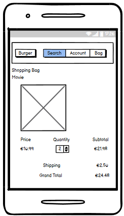
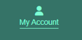
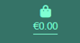
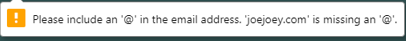
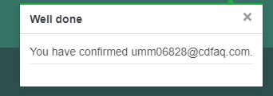

# D15 Movie Lovers Store

This is the eCommerce website of the D15 Movie Lovers Store. A store front specialising in the sale of top quality boutique label Blu Ray, 4k UHD and special editions of Movies. The overall idea from Portfolio Project 1 to this final project was to create a full D15 Movie Lovers Club which would incorporate a Blog (Portfolio Project 4), Quiz (portfolio Project 2) and a Store Front (portfolio Project 5) to cater to a healthy and growing Movie Lovers club in the Dublin 15 area. And also to grow a separate customer base with niche interests in Physical Media through this eCommerce platform. I have a secondary goal of signing up non club customers to a Newsletter with the intention of also growing the club member numbers by eventually offering Club Member only discounts and special deals, through the Newsletter, in association with the UK Blu Ray labels such as Eureka, Arrow Video, Indicator and 88 films.

# View live site here: https://d15-movie-lovers-store.herokuapp.com/

# Test Card for transactions: 4242 4242 4242 4242 Date: 04 24 CVC: 242 ZIP: 42424

# Marketing Strategy

## <u>Customers</u>
The site caters to a niche customer base. People whom appreciate the experience of watching movies in the highest quality possible. Physical media enables us to enjoy films, of all types and genres, in their best formats through modern remastering techniques, proper and original colour gradings and free from the inadequacies of streaming platforms such as poor availability of titles and artefact creep (blocky transitions) in darkly shot scenes. There is a healthy customer base of 'Movie Lovers' as evident in the availability of extremely rare films on modern boutique label releases. A quick scan of the bigger boutique label companies in the UK such as 88 Films, Eureka, Indicator and Arrow Video (not to mention the myriad of labels in the US) and its clear there is a healthy desire still for high quality physical media.

## <u>Products</u>
This platform will cater to the Irish customer base and I believe it is the only Physical Media dedicated site in Ireland. The primary product focus is the sale of high quality Blu Ray, 4k UHD and Special Editions of films. The product will be sourced in bulk from the UK labels 88Films, Eureka, Arrow Video and Indicator. With future expansion the company could source US editions from labels such as Vinegar Syndrome, Shout Factory, Scream Factory etc. The company also intends to stock Movie Memorabilia, T-Shirts, Action Figures, Vinyl Soundtracks etc as the customer base grows.

## <u>Payment</u>
Stripe has been implemented to the site as a relatively user friendly payment system. The payment structure to the site is a common process. Client will add the items they wish to buy to the Bag, enter secure checkout, validate the purchases on the summary, enter the payment screen, enter personal details and credit card details and complete purchase.

# Web Marketing
## Users:
Users are people interested in Physical Media collecting and Movie Lovers. Users can regularly be found in dedicated blogs, Dedicated FaceBook groups, Instagram channels and commenting on Physical Media youtube videos. While it's hard to make an informed judgement on the age group of Physical Media customers I will say, from my own engagements and club memberships, that it seems to be more common in the 30-60 age group. 

## Which Social Media Platform to use for promotion:
According to Hootsuite.com (Link: https://blog.hootsuite.com/facebook-statistics/):
- 50% of Facebook Users want to discover new products through Facebook stories.
- There are 1 Billion active users in the Facebook Market place.
- Facebook marketplace ads reach 562 million people.
- 79% of monthly users are active daily and finally Facebook is the favourite social platform of the 35-44 demographic.

It is clear from the stats above that using Facebook to promote the D15 Movie Lovers Store is essential. However Youtube and Instagram will also be implemented in the future. According to Wallaroomedia (link: https://wallaroomedia.com/blog/social-media/tiktok-statistics/) 80% of US Tik Tok Users are aged between 18-34. The age range and the general use of Tik Tok as a performance platform I don't see how Tik Tok could help the promotion of the D15 Movie Lovers Store at this time. Efforts should be spent on promotion through Facebook.

## Online Content and User engagement:
From my own experiences as a movie collector and avid Physical Media champion I find a lot of my information comes from Facebook groups, Youtube creators and reviewers and Instagram influencers regularly creating content around upcoming releases, rumoured releases and unboxing and review based content. It is my intention to start a channel with Youtube and a page with Instagram to compliment the Facebook page at a future date. Online creators have been instrumental in my own sourcing of Blu Ray, 4k UHD and special editions of certain Movies and I believe I can also engage with customers, Club Members and a wider untapped audience through such content.

## Sales and Discounts:
The business will run Sales over holiday periods and intermittent Club Member discount campaigns throughout the year. However the Offers section of the website is currently blank and will be updated once an actual offer campaign is devised.

## Business Goals and strategy:
The business goal is to first and foremost sell our product, for profit to our target demographic. A secondary goal is to add memebers to the D15 Movie Lovers Club and to grow the business customer base in Ireland using the Club and Newsletter. The marketing strategy for the site will be Search Engine Optimisation, email marketing through the Newsletter and social media marketing with the implementation of a Facebook page. I intend to grow the Facebook page and regularly post updates on new releases, low stock items, general movie 'banter' etc.

The beauty of using basic SEO, the Facebook page and the Newsletter for marketing is its free. I don't intend to spend on advertising until I know I have used this strategy as far as it will take the platform.

## Email Marketing
I set up a custom Newsletter service. Once the User registers with the site they can then sign up for the Newsletter.

## Facebook page:

## Privacy Policy:
https://www.privacypolicygenerator.info was used to generate a standard Privacy Policy.

Please see Privacy Policy here:
https://www.privacypolicygenerator.info/live.php?token=rvpuphBIoDGo13y658txPwQQ9RnYARQQ

## Search Engine Optimization:
The site was built with Key Words in Mind. Throughput the site you will note the use of keywords directly related to Movies. A basic list of keywords I include below for reference:

## Sitemap.xml
A sitemap was generated and included using XML-sitemaps.com. This lists the relevant URLs to facilitate search engine navigation through the site with a goal to making the site more likely to display as high up the search engine listing as possible. The sitemap was generated by following these steps:
1. Navigate to XML-sitemaps.com
2. Paste in the deployed site where prompted
3. Download the sitemap file
4. Make sure the file is named 'sitemap.xml and add it to the root folder 

## robots.txt
I created a robots.txt file to ensure search engines dont crawl through sensitive sections of the site. Which ultimately facilitates a more robust search engine process and improving the SEO overall.

# Strategy

## <u>Agile</u>
* The Agile framework was applied to this project using Github views and issues tab. I created a template and applied the template to each user story.
* I collected the user stories by interviewing a family member as a mock user.
* I assembled the user stories onto a kanban board in Github under the headings 'To Do', 'In Progress' and 'Done'. Using each column effectively kept the project moving toward completion. Breaking the work up into iterations helped to reduce the enormity of the project to manageable work sessions.
* Learning from my Portfolio Project 4 feedback I also implemented a tag system to highlight the requirments of each work item. Adding to this a commented update on each work item while implementing an imagined feedback from a Project Manager to mimic a real world setting.
* Not all user stories were effectively completed however I have retained all non completed work items as a baseline for improvement and adding features in the future.

## <u>Project Goal</u>
* The idea behind the D15 Movie Lovers Store was to create a store that can easily fit in with my previous portfolio projects: PP1 The D15 Movie Lovers Club and PP2 The D15 Movie Lovers Quiz and PP4 The D15 Movie Lovers Blog with the overall intention to merge these projects up into one well structured Club page with a store front, club page, social aspect through the Blog and user interactivity with a movie quiz. I believe there is a desire and hunger in my local area for Movie lovers to unite and my club ambitions with an associated store could be a successful club and business plan. 
* I kept the styling, colours and overall look in line with my PP1, PP2 and PP4 with a long term goal of merging the three projects together to create a viable club website with member(user) interactivity and contributions with a focus on responsive and simple design.
* I want Users to register, log in and log out in a simple manner while being able to read stock item descriptions with ease facilitating regular purchases. I also added a review function allowing users to add, edit and delete reviews of the Stock Items. This helps to create a bigger sense of belonging with the buisness users and club users.
* Implement full CRUD functionality in allowing the user to write, edit and delete a review.

## <u>Data Models</u>
* I have listed the models used below for quick reference and included in a basic schema:
1. <u>In the checkout app:</u>
- class Order(models.Model)
- class OrderLineItem(models.Model)
2. <u>In the Home app:</u>
- class Subscriber(models.Model)
3. <u>In the Products app:</u>
- class Genre(models.Model)
- class Region(models.Model)
- class Format(models.Model)
- class Stockitem(models.Model)
- class Review(models.Model)

* Full Models Schema:

* Individual Models:

## <u>User Stories</u>
## Completed User Stories:
<u>As a regular visitor to the site I can:</u>
- login with ease so that I can get to shopping quickly or write up reviews

- read simple product descriptions so that I am better informed of my product choices

- easily search for products so that I can find specific products without the need to view all products

- view high quality images of the products so that I can pick my desired product with ease

- sign up for a newsletter so that I can stay informed of new updates to the store

- filter the stock items so that I can quickly find what I am looking for

- view my cart but also return to shopping without entering the payment screen so that return to shopping and payment are two separate options which makes it easier to return to shopping or go to payment

- easily pay for my selected products so that I am more likely to visit the store again

- gather my selected products in a user friendly shopping cart so that I can review and pay for my products with ease

- delete my reviews so that I can remove my reviews when I see fit

- write reviews of products on a user friendly form so that I feel more connected with the club and the company

- easily edit my reviews so that I can make sure my reviews are accurate

## User Stories not completed in this iteration:
<u>As a regular visitor to the site I can:</u>
- leave reviews and ratings so that I can help better inform the next person of the quality of the product

- select a 'Notify Me' option when a product is out of stock so that I am notified when the product is in stock

- clearly see stock availability for each product so that I can make a more informed decision when shopping

- easily visit the stores social media presence** so that I can engage with the business more regularly

The four user stories not completed have been noted for future development. It was simply a timing issue in this case to not include these stories in the initial development block. An effort to prioritise work items rendered the four above non essential.

## <u>Design</u>
The project scope was reduced and simplified as I approached my deadline. I decided to concentrate on coding the store in a simple fashion with full CRUD functionality intact. 

The user stories relating to 'ratings', 'Notify me', 'Stock availability' and 'social media presence', while not implemented at this stage of development due to timing constraints will be added to the store at a later date.

I relied very heavily on the course content walkthrough project 'Boutique Ado' and while a lot of the desigin elements from the project has carried over I made sure to 'reengineer' the design to my own purposes. Hence the colour scheme and Typograpy are used from the previous portfolio projects PP1, PP2 and PP4. This is to maintain a uniform approach so as when the individual projects are merged into one Store/Club offering for the D15 area, the design will match.

The main colour scheme used is:
- Background Colour: #2F4F4F
- Header colour: #357367
- Text colour: Aquamarine

## Imagery
As the site is a movie physical media store I have included 11 films as example products. I chose films that are a mixture of well known classics and some rarer titles to appeal to the collector sensibility

## <u>Wireframes</u>

* Landing page desktop:

* All Products page desktop:

* Individual Product page desktop:

* Secure Checkout page desktop:

* Checkout page desktop:

* Payment Complete page desktop:

* Landing page tablet:

* All Products page tablet:

* Individual Product page tablet:

* Secure checkout page tablet:

* Checkout page tablet:

* Payment complete page tablet:

* Landing page mobile:

* All product page mobile:

* Individual product page mobile:

* Secure checkout page mobile:

* Checkout page mobile:

* Payment complete page mobile:

## <u>Differences between the Wireframes and finished blog</u>

* You will note from the mobile Wireframe presentation that the Search, Account and Bag icons should be aligned. Unfortunately as time was becoming more of an issue I sacrificed fixing the Search, Account and Bag icons in the actual site. Currently they are slightly un-aligned.
* Generally speaking the site matches the Wireframes with some very small variances.

## <u>Features</u>

* Nav Bar, built using bootstrap and visible across the site

* Sign up form feature:

* My Account and Bag buttons on the Nav Bar highlights when hovered on

* Every button on the site highlights when hovered on:

* Drop down list generates when user clicks on the My Account button Superuser example:

* Drop down list generates when user clicks on the My Account button non Superuser example:

* If there is nothing in the bag and the bag button is clicked the User is presented with a bag empty page:

* When the Movies and Blu Ray buttons are clicked on the nav bar a drop down menu presents to allow the user to access the type of product they're looking for with ease. If the user selects Price the products will be arranged by low to high, if the user selects Genre the Genres will be arranged alphabetically and if the User selects all products, all products will be shown. However I must note that due to timing the rating system was not implemented in development, therefore when a user clicks on this option it will generate in the same way the All Products option displays. Also to note the Special Offers section has not yet been implemented, this has been noted for future development:

* Search bar in the header is fully functional:

* The Landing page introduces the user to the site and asks the user to register:

* Once the User has registered, the message changes to ask the user to sign up for the Newsletter:

* The user can click on either the Movie image or the movie title to generate the single product page:

* When a user adds a product to the bag a bag summary displays in the top right of the page:

* A dropdown box for sorting options displays to the right above the products to give the user the ability to sort the products by Price Low to High, Price High to Low, Name A-Z, Name Z-A, Genre A-Z and Genre Z-A (as previously noted the rating option is not functional at this time):

* A user can add, edit and delete review which satisfies CRUD and is also presented with notification messages on each function:

* A functional quantity update button added to checkout page:

* An example of quantity updated using the button:

* Order summary in the checkout page:

* A message displays if the user has not entered a correct email:

* A message displays on successful checkout:

* A full order summary displays once the checkout is complete:

* When a user signs in they recieve a successful sign in message:

* When a user wishes to sign out they will be prompted with a signout page:

* A custom 404 page was added:

* Django admin panel was used for this project. Out of the box it enables full administration functions. I include a screenshot of the base page below to give the reader an indication of the different functions added as per project requirements:

* New user sign up with email confirmation. I registered a new user using https://10minutemail.net/ to show how the email verification works once the user has registered, screenshots showing the process below:

* Newsletter functionality. As the superuser I can write up a newsletter and send it to the subscribers. The send Newsletter option only generates in the superuser profile drop down list as per example included above. To show the newsletter functionality actually working I registered a new user using https://10minutemail.net/ to have an active mailbox available to show how the user would recieve the newsletter. Screenshots of the Newsletter functionality included below:

* When the user clicks 'Shop Now' on the landing page, they are presented with all products. They can then sort and search as they need as per feature entries above.

* Stripe was implemented as the payments system. The test card used was: 4242 4242 4242 4242 Date: 04 24 CVC: 242 ZIP: 42424. I include a screenshot of recorded purchases below:

## <u>Features Left to Implement</u>

* User profiles. Implementing a User Profile would make the user experience more detailed by giving the user access to previous purchases for their own reference. Extra functionality like a points system, in which users will earn points with each purchase to use toward future purchases to reduce the price, could be incorporated into this.

* Special Offers. The special offer page is currently not coded. This was a timing issue and I plan to add a robust special offer section to the site in the future.

* Ratings. The rating system is also not implemented despite showing on the product images. I would like to incorporate the rating system to work along side the user review section in future development.

* I intended to add a 'Notify me when back in stock' function to the site. I planned to include a product that was noted as sold out. When a user would click the 'Notify me when back in stock' button it would generate a note on the profile in the admin panel and send them an email confirming their selection.

* Stock availability. Adding a stock counter to each stock item would help to inform users of low stock on items. This would be particularly pertinent to special editions aor low stock run items. This functionality would also help to service collectors and their more demanding approach to obtaining particular items.

* As this store is intended to be merged with the D15 Movie Lovers Club, the D15 Movie Lovers Quiz and the D15 Movie Lovers Blog, it was my intention to add the links back to these delpoyed sites as well as adding a link to the D15 Movie Lovers Store facebook page. This shoulod be a relatively easy next step for future development. However as the scope of the development was bearing down toward the deadline I chose to add this work item to future development.

* I also plan to develop a club logo and replace the rudimentary D15 Movie Lovers heading on each of the PP1, PP2, PP4 and PP5 projects.

* The product descriptions accompanying each product was copied from Amazon. I would prefer to take the time to write up my own product descriptions for each stock item.

* Fixing the Nav Bar for Mobile devices. While in its current state it is fully functional It looks uneven and needs further development to align across the top of the header.

## <u>Testing</u>

I used the W3c Markup validator, the W3C CSS Validator and the Pylint tool built into the terminal.

# W3C Markup validator results:

* W3C Markup results for https://d15-movie-lovers-store.herokuapp.com:

* W3C Markup results for https://d15-movie-lovers-store.herokuapp.com/products/:

* W3C Markup results for https://d15-movie-lovers-store.herokuapp.com/products/10:

* W3C Markup results for https://d15-movie-lovers-store.herokuapp.com/newsletter/:

* W3C Markup results for https://d15-movie-lovers-store.herokuapp.com/bag/:

* W3C Markup results for https://d15-movie-lovers-store.herokuapp.com/checkout/:

* W3C Markup results for https://d15-movie-lovers-store.herokuapp.com/checkout/checkout_success/:

* W3C Markup results for https://d15-movie-lovers-store.herokuapp.com/accounts/logout/:

* W3C Markup results for https://d15-movie-lovers-store.herokuapp.com/accounts/login/:

* W3C Markup results for https://d15-movie-lovers-store.herokuapp.com/accounts/signup/:

* You will note that the validation results for every screen above contain the same errors and warnings. As the code the errors relate to was used from the Boutique Ado walkthrough project I assume they are bootstrap issues. As the warnings do not interfer with functionality I left the code as is to maintain a functioning site. There were other incidental errors noted on my custom code however I fixed those errors as part of testing.

# W3C CSS validator results:

# Pylint validator results:

* views.py:

* models.py:

* I note there are some 'line too long' errors within the pylint results. I believe these errors are not a big problem and at risk of breaking code I left them as they were.

# lighthouse test:

* Lighthouse test desktop:

* Lighthouse test mobile:

## Bugs

* If the user has a chrome download bar (the bar that contains your downloaded item) at the bottom of the desktop screen it will push some text upwards on the signup and login pages.

* The add remove items from the checkout screen is uneven and ugly on the mobile view. This is a throwback to the boutique ado code which was used in this section of the project.

* I have used a generic SKU number for the products - I was unsure where to fiund the actual skus. I decided to use a general sku for the purposes of showing where the SKU would go. This is obviously an importnat item and can be fixed/implemented at a later date.

* There was an attempt made to implement cloudinary however this was scrapped. You will note veistigaes of the attempt in the requirements.txt file

* Due to the Heroku changeover (dyno change and chare structure implemented) I deployed early. When I loaded my site locally my static files didnt render. I fixed this after some time by changing Debug back to True.

# <u>Testing user stories</u>

1. As a regular visitor to the store I can easily pay for my selected products so that I am more likely to visit the store again

* Goal - This user story was requested to ensure the user had a seamless path from selecting a product to buying the product

* Action - I logged in as a registered user and processed a purchase. I was able to complete my purchase quickly and hassle free.

* Expected Outcome - Simple and standard track from logging in to product purchase.

* Actual Outcome - As a user I was able to log in, select my product and purchase my product in a very user friendly and quick fashion.

* Test passed - Yes.

2. As a regular visitor to the store I can gather my selected products in a user friendly shopping cart so that I can review and pay for my products with ease

* Goal - Implement a very standard and common shopping cart/bag function

* Action - I processed an order of a number of stock items.

* Expected Outcome - The stock items would gather in a structured order in the cart and display a user friendly summary.

* Actual Outcome - The stock items when selected for purchase organised in a very standard shopping bag and displayed very clearly for the user to reference

* Test passed - Yes.

3. As a regular visitor to the store I can add, edit and delete my reviews. (Including the three user stories here for one test method)

* Goal - Adding the review section to the site was a way to give the user more functionality and a reason to stay a little longer on the page. Users should be able to add a review of a selected stock item, edit that review and delete the review.

* Action - I logged in as a registered user and created a review, edited the review and deleted the review.

* Expected Outcome - Create, edit and delete a review.

* Actual Outcome - I was able to create, edit and delete a review.

* Test passed - Yes.

4. As a regular visitor to the store I can view my cart but also return to shopping without entering the payment screen so that return to shopping and payment are two separate options which makes it easier to return to shopping or go to payment

* Goal - adding a return to shopping button on the checkout summary will give the user an easy way to return to shopping without entering the checkout page. This makes it easier for users to purchase more items in a user friendly way.

* Action - I logged in as a registered user and selected a stock item to purchase. Once I clicked 'Add to Bag' the checkout summary generates without proceeding to the checkout leaving me to continue shopping with ease.

* Expected Outcome - Add stock items to bag, click continue shopping and continue shopping with ease.

* Actual Outcome - While there is no 'Return to Shopping' button in the checkout summary, there is instead a 'Go to secure checkout' button. This meant that I was able to continue shopping with ease without the need to click a button. This is in fact a more user friendly approach without having the user to click a button.

* Test passed - Yes, I note there is no return to shoppping button on the checkput summary but there doesnt need to be. Instead I left it up to the user to click 'Go to secure checkout' when they are ready to do so.

5. As a regular visitor to the store I can filter the stock items so that I can quickly find what I am looking for.

* Goal - Adding a filter function to the store gives the user the ability to filter the stock items to their preference.

* Action - I logged on as a registered user and filtered the items by Price, Genre and Name .

* Expected Outcome - The stock items would generate by price low to high unless I select Price High to low from the drop down list. The Genres would group one beside the other and the Name would alphabetize A-z or Z-a depending on my selection.

* Actual Outcome - Genres grouped together, Price generated low to high or high to low depending on my selection and Name alphabetized A-Z or Z-a depending on my selection.

* Test passed - Partially, There are options to sort by rating which has been noted for future development.

6. As a regular visitor to the store I can sign up for a newsletter so that I can stay informed of new updates to the store

* Goal - Adding a Newsletter to the site for registered users is a good way to keep in touch with your customers and clients. 

* Action - Logged on as the superuser and sent a test newsletter to those users that signed up for the newsletter.

* Expected Outcome - The newsletter would arrive in the registered users inbox.

* Actual Outcome - The test newsletter arrived in the registered users inbox.

* Test passed - Yes.

7. As a regular visitor to the store I can view high quality images of the products so that I can pick my desired product with ease.

* Goal - Using high quality images for the site is an essential step in ensuring your clients trust what they want to purchase.

* Action - Visited site and reviewed each stock item image. All are quality representations of the actual stock item.

* Expected Outcome - High Quality images present on site.

* Actual Outcome - High quality images are visible on site.

* Test passed - Yes.

8. As a regular visitor to the store I can easily search for products so that I can find specific products without the need to view all products.

* Goal - Adding a search function to the site gives users the ability to search for a single item further streamlining their experience.

* Action - Logged onto the site and searched for each stock item separately.

* Expected Outcome - Each stock item would show when I search for it.

* Actual Outcome - On each search the right stock item would present on clicking search.

* Test passed - Yes.

9. As a regular visitor to the store I can read simple product descriptions so that I am better informed of my product choices.

* Goal - Each stock item should have a detailed breakdown of the item accompanying the high quality image. This is an essential step in securing repeat custom.

* Action - logged on to site and inspected each stock item. A detailed product description accompanies each stock item.

* Expected Outcome - A detailed product description accompanies each stock item.

* Actual Outcome - each stock item has a detailed description.

* Test passed - Yes.

10. As a regular visitor to the store I can login with ease so that I can get to shopping quickly or write up reviews

* Goal - Easy log in should be an essential addition to this site giving users a peace of mind that to shop on this site is hassle free.

* Action - logged on and started shopping.

* Expected Outcome - I would log in very quickly.

* Actual Outcome - I logged in very quickly.

* Test passed - Yes.

11. As a regular visitor to the store I can leave reviews and ratings so that I can help better inform the next person of the quality of the product

* Goal - adding a rating system to accompany the review functionality would make the site more dynamic for returning users nd give existing users a reason to visit the site more often.

* Action - Logged in and wrote a review however I was unable to leave a rating.

* Expected Outcome - Ability to write a review however unable to leave a rating

* Actual Outcome - Review was written however I was unable to leave a rating.

* Test passed - partially, the rating functionality has been noted for future development.

12. As a regular visitor to the store I can easily visit the stores social media presence so that I can engage with the business more regularly

* Goal - Including links to social media is essential to maintaining engagement with the users and clients.

* Action - No action - this has been included for future development.

* Expected Outcome - No expected outcome - noted for future development

* Actual Outcome - No Outcome.

* Test No - This work item has been noted for future development.

13. As a regular visitor to the store I can clearly see stock availability for each product so that I can make a more informed decision when shopping.

* Goal - Including stock availability numbers is a good idea to keep the users informed of stock levels. This will become particularly pertinent when stocking special editions or limited editions.

* Action - No action - this has been included for future development.

* Expected Outcome - No expected outcome - noted for future development

* Actual Outcome - No Outcome.

* Test No - This work item has been noted for future development.

14. As a regular visitor to the store I can select a 'Notify Me' option when a product is out of stock so that I am notified when the product is in stock.

* Goal - Adding this functionality would give users the ability to click a 'Notify me when back in stock' button giving users the peace of mind that should the item they want arrive back in stock they will be notified.

* Action - No action - this has been included for future development.

* Expected Outcome - No expected outcome - noted for future development

* Actual Outcome - No Outcome.

* Test No - This work item has been noted for future development.

## Further Testing:

* I tested the site extensively, all links, pages and functions are working and in a good state.

* A huge amount of testing was done with friends and family Members. My wife proof read this ReadMe file. General feedback was very positive.

* I tested the site on Google Chrome, Mozilla Firefox and Microsoft Edge. I did not test it on Internet Explorer as it is no longer supported.

* The site is fully functional across Desktop, Tablet and mobile devices. However as noted for future development the Nav Bar needs work in mobile view.

# <u>Security</u>

* CSRF Tokens were used in the development cycle
* DEBUG was set to false before deployment
* All secret keys were hidden
* Stripe implements its own security on transactions
* The site uses registration for users which includes a verification system via a verification email sent to the users inbox. This hjleps prevent unwanted users having easy access to the site
* Defensive Design is inherent in Django preventing users submitting empty forms etc

## <u>Technologies Used</u>

* HTML5
* CSS
* Bootstrap
* Python
* Django
* Allauth - within Django framework
* Crispy Forms - within Django framework
* Heroku postgres
* Gitpod
* Github
* fontawesome
* Balsamiq - Wireframes
* W3C Validation
* W3C CSS Validation
* Pylint python Validation
* Javascript
* Stripe
* AWS
* elephantSQL
* jsonformatter.org
* 10minutemail.net
* xmlsitemaps
* Django secret ket generator

## <u>Deployment</u>

Heroku was used to deploy the site. The project was deployed using the following steps:

1. Log into Heroku and create a new app

2. Create an external database using ElephantSQL

3. Log into Elephant SQL, click create new instance

4. Set up plan, select Tiny Turtle which is free, leave tags field blank

5. Select your region, mine was amazon-web-services::eu-west-1

6. Click Review

7. Ensure details are accurate and click Create Instance

8. Return to the ElephantSQL dashhboard and click on your project instance

9. Copy the URL to the clipboard

10. In the terminal install dj_database_url and psycopg2 to connect to the external database

11. Update the requirements.txt file

12. Import dj_database_url in the settings.py file

13. Run the showmigrations command to confirm you are connected to the external database

14. Migrate the database models

15. Create a superuser

16. On the elephantSQL page for the database select browser

17. Click the table queries button and select auth_user

18. On the deploy tab on Heroku, click settings, click reveal config vars

19. Add the following: 
- DATABASE_URL followed by the URL of the ELephantSQL database
- PORT 8000
- SECRET_KEY followed by the project secret key
- DISABLE_COLLECT_STATIC (for development only this should be removed when deploying the site)

20. On the Deploy tab, connect to GitHub, (search for the repository name)

21. At the bottom of the deploy page, Enable Automatic Deploys. This allows for automatic deployment when you push to GitHub

## <u>Forking the GitHub Repository</u>

We can make a copy of the of the original repository by forking the GitHub repository. This allows us to view or amend the without affecting the original repository

1. Log in to GitHub and select the repository

2. The fork Button is located at the top of the Repository, click it

3. A copy of the Repository should be created

## <u>Making a local clone</u>

1. Log into GitHUb
2. Select the Repository
3. Click Clone or Download
4. To clone the repository using HTTPS under 'Clone with HTTPS' copy the link
5. Open Git Bash
6. Change the working directory to the location where you want the cloned directory
7. Type 'git clone' and paste the URL
8. Press enter and the local clone will be created

## <u>Credits</u>
* I heavily relied on the course content walkthrough project for Boutique Ado. The entire project was built using the guidance of the Boutique Ado course content in particular the boostrap application and some CSS which I used from the walkthrough to help make the site responsive and functional. My sincere thanks to Code Institute for the Boutique Ado Walkthrough Project content as without it I would not have completed this project.

* Stack Overflow, W3Schools web tutorials.

## <u>Acknowledgments</u>

* My wife and children for their unwavering support and patience. Finally now I can make up for lost time over this extremely difficult year

* Tutor support

* Mike Sheehan for his unwavering support

* Kevin Loughrey for his invaluable tutoring and encouragement in the darkest hours